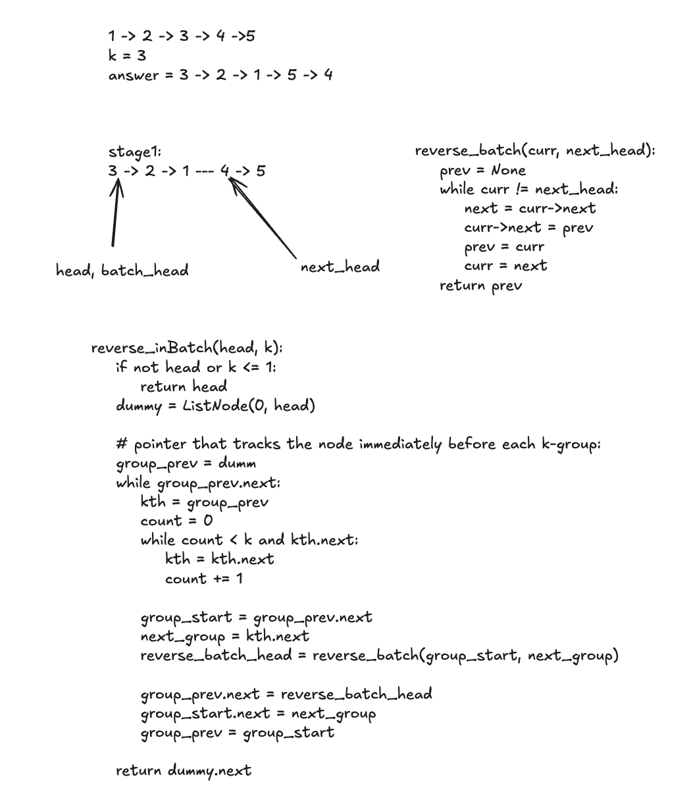

Given the head of a linked list, reverse the nodes of the list k at a time, and return the modified list.
k is a positive integer and is less than or equal to the length of the linked list.
If the number of nodes is not a multiple of k then left-out nodes, in the end, are reversed.



```
# Definition for singly-linked list.
# class ListNode:
#     def __init__(self, val=0, next=None):
#         self.val = val
#         self.next = next
class Solution:
    def reverse_batch(self, curr, next_head):
        prev = None
        while curr != next_head:
            nxt = curr.next
            curr.next = prev
            prev = curr
            curr = nxt
        return prev

    def reverseKGroup(self, head: ListNode | None, k: int) -> ListNode | None:
        if not head or k <= 1:
            return head
        dummy = ListNode(0, head)
        group_prev = dummy
        while group_prev.next:
            kth = group_prev
            count = 0
            while count < k and kth.next:
                kth = kth.next
                count += 1
            group_start = group_prev.next
            next_group = kth.next
            reversed_group_head = self.reverse_batch(group_start, next_group)

            group_prev.next = reversed_group_head
            group_start.next = next_group
            group_prev = group_start
        return dummy.next
```